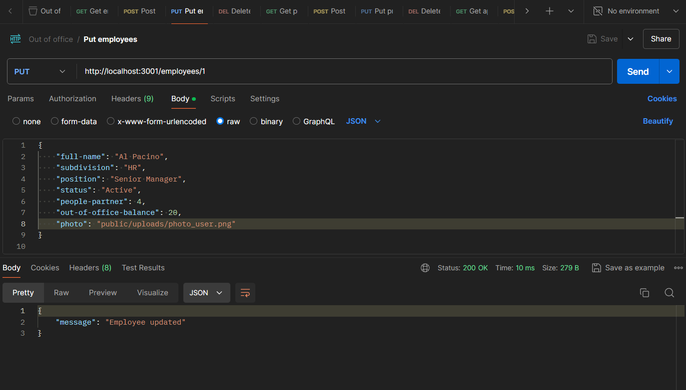

# Out of Office Management System

## Project description

This project is a leave management system for company employees. It allows HR managers, project managers, and employees to manage leaves, projects, and approval requests.

## Features

- CRUD operations for employees, projects, leave requests, and approval requests.
- Role-based access control for different roles (HR Manager, Project Manager, Employee).

## Technologies

- Node.js
- Express.js
- MySQL
- Postman for testing API
- HTML
- CSS (Bootstrap)
- JavaScript

## Installation and Setup

### Prerequisites

- Node.js
- MySQL

### Installation

1. **Clone the repository:**

   **console**
   git clone https://github.com/PraBWa04/Out-of-Office-Management-System.git
   cd Out-of-Office-Management-System

2. **Install dependencies:**
   **console**
   npm install

3. **Set up the MySQL database:**

- Create a MySQL database named OutOfOfficeDB.
- Import the database.sql file into your MySQL database.

4. **Configure the database connection**:

Ensure your server.js file has the correct database connection settings:

**javascript**
const db = await mysql.createConnection({
host: "localhost",
user: "root",
password: "YOUR_PASSWORD",
database: "OutOfOfficeDB",
});

Running the Application
Start the server:
**console**
npm start
Open your browser and navigate to:

**console**
http://localhost:3001

**API Endpoints**
**Employees**
GET /employees
Get all employees
GET /employees/
Get employee by ID
POST /employees
Add new employee
PUT /employees/
Update employee by ID
DELETE /employees/
Delete employee by ID
**Projects**
GET /projects
Get all projects
GET /projects/
Get project by ID
POST /projects
Add new project
PUT /projects/
Update project by ID
DELETE /projects/
Delete project by ID
**Leave Requests**
GET /leave-requests
Get all leave requests
GET /leave-requests/
Get leave request by ID
POST /leave-requests
Add new leave request
PUT /leave-requests/
Update leave request by ID
DELETE /leave-requests/
Delete leave request by ID
**Approval Requests**
GET /approval-requests
Get all approval requests
GET /approval-requests/
Get approval request by ID
POST /approval-requests
Add new approval request
PUT /approval-requests/
Update approval request by ID
DELETE /approval-requests/
Delete approval request by ID

**Role-based Access Control**
_HR Manager:_

- Full access to employees and approval requests.
- Read-only access to leave requests and projects related to their employees.
  _Project Manager:_
  - Full access to projects and approval requests.
  - Read-only access to leave requests and employees related to their projects.
    _Employee:_
  - Full access to their own leave requests.
  - Read-only access to approval requests related to their own leave requests and their projects.
    **Screenshots**
    
    
    
    
